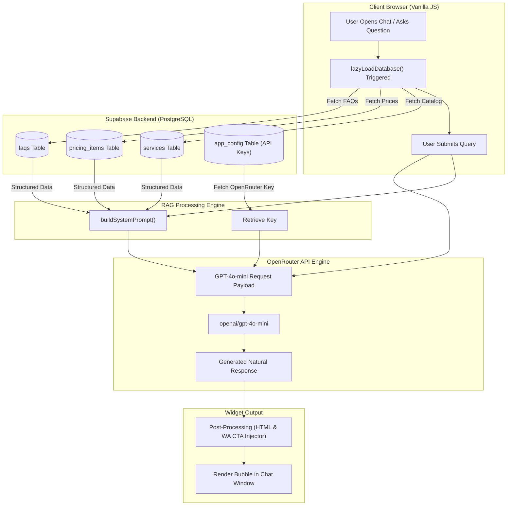

# 🌸 Imar Salon — Web Portal & RAG-Powered AI Virtual Assistant

[](https://developer.mozilla.org/en-US/docs/Web/HTML)
[](https://developer.mozilla.org/en-US/docs/Web/CSS)
[](https://developer.mozilla.org/en-US/docs/Web/JavaScript)
[](https://supabase.com)
[](https://openrouter.ai)

Official web platform for **Imar Salon Yogyakarta** featuring a responsive customer portal and an integrated **RAG-Powered AI Virtual Assistant**. The system dynamically syncs salon services, pricing lists, operation FAQs, and customer reviews directly from a **Supabase PostgreSQL** backend, delivering real-time, context-bounded AI support and seamless WhatsApp booking flows.

---

## 📋 Table of Contents

- [✨ Key Features](#-key-features)
- [🏗️ RAG & AI Architecture](#️-rag--ai-architecture)
- [🛠️ Tech Stack](#️-tech-stack)
- [📂 Project Structure](#-project-structure)
- [🗄️ Database Schema](#️-database-schema)
- [🚀 Quick Start & Installation](#-quick-start--installation)
- [🤖 How the RAG AI Assistant Works](#-how-the-rag-ai-assistant-works)
- [📱 Web Pages Overview](#-web-pages-overview)
- [🔒 Security & Best Practices](#-security--best-practices)
- [📜 License & Credits](#-license--credits)

---

## ✨ Key Features

### 💻 Web Portal & Customer Experience
- **🎨 Elegantly Styled UI**: Custom responsive design using modern CSS variables, glassmorphism, subtle micro-interactions, and typography powered by *Playfair Display* & *Montserrat*.
- **📸 Interactive Hero Slider**: Card-stack auto-cycling photo gallery highlighting salon styles and atmosphere.
- **💈 Dynamic Services Catalog**: Auto-populated catalog fetched asynchronously from the Supabase database.
- **🏷️ Interactive Pricing Directory**: Tabbed pricing categories with search filters and starting price indicators.
- **⭐ Real-Time Review Carousel**: Dynamic Google & customer reviews synced with Supabase, complete with client-side relative time calculations (`timeAgo`) and avatar fallback generation.

### 🤖 Smart AI Assistant (RAG Engine)
- **🧠 Dynamic Database Retrieval**: Fetches real-time catalog items, pricing structures, and FAQs from Supabase to serve as grounding context.
- **🎯 Scope Bounding & Fallback**: Programmatically restricted to respond *only* to Imar Salon queries, preventing hallucination or off-topic usage.
- **💬 Direct WhatsApp Booking CTA**: Automatically detects booking intent and appends dynamic WhatsApp reservation call-to-action buttons.
- **⚡ Lazy Loading & Caching**: Pre-fetches backend context on widget expand to ensure instantaneous conversational turns.

---

## 🏗️ RAG & AI Architecture

The AI Virtual Assistant utilizes a **Retrieval-Augmented Generation (RAG)** pipeline where real-time operational data is fetched from Supabase tables and injected into the **GPT-4o-mini** system prompt via OpenRouter.



---

## 🛠️ Tech Stack

| Domain | Technology / Library | Purpose |
| :--- | :--- | :--- |
| **Frontend** | HTML5 / Vanilla CSS3 / JavaScript (ES6+ Modules) | Lightweight, zero-dependency, ultra-fast web rendering |
| **Backend & DB** | [Supabase](https://supabase.com/) (PostgreSQL DB) | Storing services, pricing, customer reviews, FAQs & configs |
| **AI LLM Gateway** | [OpenRouter API](https://openrouter.ai/) | Gateway to execute `openai/gpt-4o-mini` |
| **Typography** | Google Fonts (*Montserrat*, *Playfair Display*) | Premium aesthetic and luxury styling |
| **Icons & Media** | SVG Inline Icons & Optimized WebP Assets | Fast page performance & crisp visuals |

---

## 📂 Project Structure

```
Saloon_1_Simple_Web/
├── README.md                          # Comprehensive Project Documentation
└── imar-saloon/                       # Application Root Directory
    ├── index.html                     # Landing Page (Hero, Services, Reviews Carousel)
    ├── assets/                        # High-resolution WebP images & logos
    │   ├── logo_imar.webp
    │   ├── logo_imar_peachpuff.webp
    │   └── photo1.webp ... photo9.webp
    ├── connection/
    │   └── supabase.js                # Supabase ESM Client Initializer
    ├── css/
    │   ├── assistant.css              # AI Floating Chat Widget Styles
    │   ├── mainPage.css               # Landing Page & Global Responsive Token Styles
    │   ├── pricingPage.css            # Pricing Catalog Grid & Category Tabs
    │   └── reviewPage.css             # Customer Review List & Modal Form Styles
    ├── js/
    │   ├── assistant.js               # RAG AI Chatbot Logic & OpenRouter Client
    │   ├── reviews.js                 # Dynamic Review Fetching, Filters & Carousel
    │   └── services.js                # Dynamic Services Loader from Supabase
    └── pages/
        ├── aboutPage.html             # About Us Page & Salon Details
        ├── pricingPage.html           # Full Interactive Pricing Page
        └── reviewPage.html            # Dedicated Reviews & Feedback Submission Page
```

---

## 🗄️ Database Schema

The backend database runs on **Supabase PostgreSQL**. The table structures supporting the application and AI context retrieval are outlined below:

### 1. `services`
Stores top-level service categories.
```sql
CREATE TABLE services (
    id BIGINT PRIMARY KEY GENERATED ALWAYS AS IDENTITY,
    name TEXT NOT NULL,
    description TEXT,
    image TEXT,
    created_at TIMESTAMP WITH TIME ZONE DEFAULT NOW()
);
```

### 2. `pricing_items`
Stores individual service pricing details linked to `services`.
```sql
CREATE TABLE pricing_items (
    id BIGINT PRIMARY KEY GENERATED ALWAYS AS IDENTITY,
    service_id BIGINT REFERENCES services(id) ON DELETE CASCADE,
    item_name TEXT NOT NULL,
    price NUMERIC NOT NULL,
    is_starting_price BOOLEAN DEFAULT FALSE,
    created_at TIMESTAMP WITH TIME ZONE DEFAULT NOW()
);
```

### 3. `faqs`
Stores Frequently Asked Questions injected into the RAG Assistant prompt context.
```sql
CREATE TABLE faqs (
    id BIGINT PRIMARY KEY GENERATED ALWAYS AS IDENTITY,
    question TEXT NOT NULL,
    answer TEXT NOT NULL,
    created_at TIMESTAMP WITH TIME ZONE DEFAULT NOW()
);
```

### 4. `reviews`
Stores customer testimonials displayed on the homepage and review page.
```sql
CREATE TABLE reviews (
    id BIGINT PRIMARY KEY GENERATED ALWAYS AS IDENTITY,
    name TEXT NOT NULL,
    rating INT CHECK (rating >= 1 AND rating <= 5),
    review_text TEXT NOT NULL,
    avatar TEXT,
    created_at TIMESTAMP WITH TIME ZONE DEFAULT NOW()
);
```

### 5. `app_config`
Stores secure key-value app configurations (e.g., OpenRouter API key).
```sql
CREATE TABLE app_config (
    key TEXT PRIMARY KEY,
    value TEXT NOT NULL
);
```

---

## 🚀 Quick Start & Installation

### Prerequisites
- Modern web browser (Chrome, Edge, Firefox, Safari) with ES6 module support.
- A local HTTP web server (e.g., VS Code **Live Server** or `npx serve`).

### Step 1: Clone the Repository
```bash
git clone https://github.com/CrowZF01/Saloon_1_Simple_Web.git
cd Saloon_1_Simple_Web
```

### Step 2: Serve the Application
Since the application uses standard JavaScript ES Modules (`import/export`), run it through a local HTTP server:

**Using Node.js / `npx serve`:**
```bash
npx serve imar-saloon
```

**Using VS Code Live Server:**
1. Open the project folder in VS Code.
2. Right-click [`imar-saloon/index.html`](file:///c:/Users/felix/OneDrive/Documents/GitHub/Saloon_1_Simple_Web/imar-saloon/index.html).
3. Select **"Open with Live Server"**.

---

## 🤖 How the RAG AI Assistant Works

1. **Context Pre-fetching**: When a user opens the chat widget for the first time, [`lazyLoadDatabase()`](file:///c:/Users/felix/OneDrive/Documents/GitHub/Saloon_1_Simple_Web/imar-saloon/js/assistant.js#L125) fetches services, pricing, and FAQs from Supabase and caches them in memory.
2. **Dynamic Context Building**: Before sending a message to OpenRouter, [`buildSystemPrompt()`](file:///c:/Users/felix/OneDrive/Documents/GitHub/Saloon_1_Simple_Web/imar-saloon/js/assistant.js#L207) formats cached database records into structured plain text within the LLM's system prompt.
3. **Strict Persona Control**: System instructions direct the model to answer politely, strictly adhere to prices/services listed, reject unrelated queries (e.g., math, coding), and address customers warmly using *"Kak"*.
4. **Intent Detection & CTA Injection**: If a response discusses booking or reservation, the assistant dynamically appends a WhatsApp click-to-chat CTA button directly inside the chat window.

---

## 📱 Web Pages Overview

- **`index.html` (Beranda)**: Full landing experience featuring brand values, hero photo carousel, highlighted services grid, real-time review slider, and booking CTA.
- **`pages/pricingPage.html` (Daftar Harga)**: Complete breakdown of hair care, hair styling, coloring, and makeup services with interactive filters.
- **`pages/reviewPage.html` (Ulasan)**: Customer feedback feed with rating stats, breakdown bars, and review submission dialog.
- **`pages/aboutPage.html` (Tentang Kami)**: Salon story, opening hours, location details with map integration, and contact channels.

---

## 🔒 Security & Best Practices

- **Centralized Config Storage**: API keys are securely retrieved from Supabase `app_config` table rather than hardcoded in public repositories.
- **Client-Side Sanitization**: Automatic HTML formatting sanitizes markdown bold syntax and validates time/day ranges.
- **Graceful Network Fallback**: Displays fallback messages with direct WhatsApp links if connection to OpenRouter or Supabase experiences latency.

---

## 📜 License & Credits

- **Owner**: Imar Salon Yogyakarta
- **Developer**: [CrowZF01](https://github.com/CrowZF01)
- **Built with**: HTML5, Vanilla CSS, JS ESM, Supabase & OpenRouter AI Engine.

&copy; 2026 Imar Salon. Hak Cipta Dilindungi.
